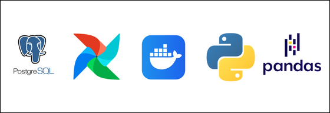
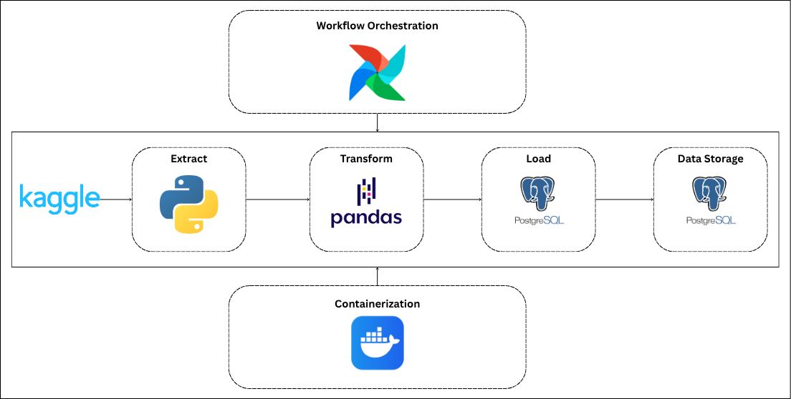
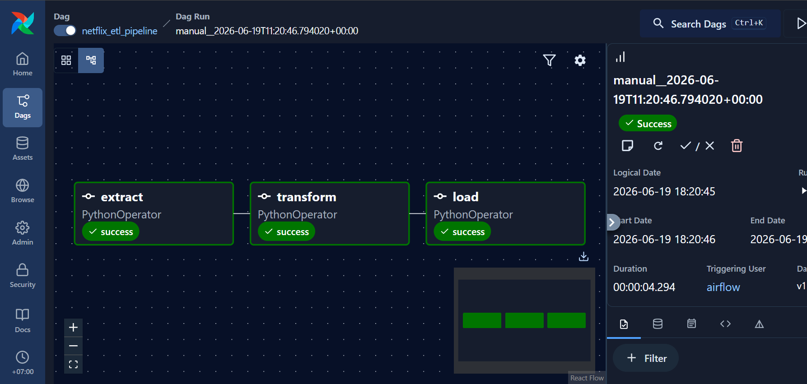
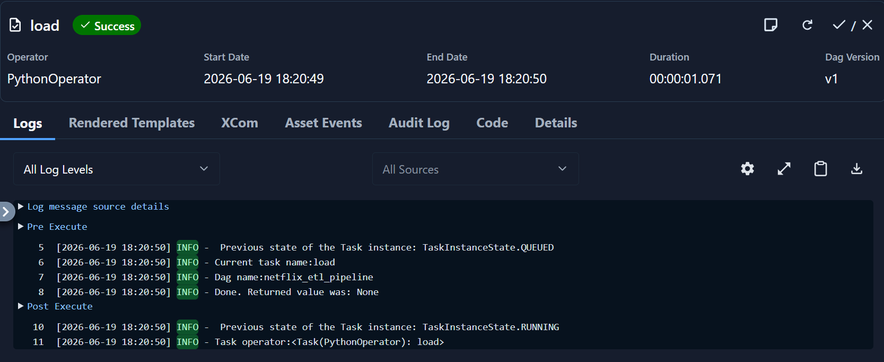
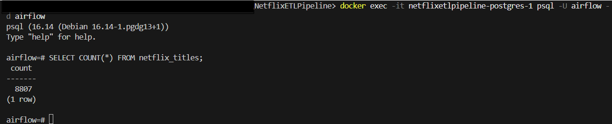

# Netflix ETL Pipeline with Apache Airflow
## Overview

This project demonstrates an end-to-end ETL (Extract, Transform, Load) pipeline using Python, PostgreSQL, Apache Airflow, and Docker. The pipeline extracts Netflix movie and TV show data from a CSV file, performs data cleaning and transformation, and loads the processed data into a PostgreSQL database. Apache Airflow is used to orchestrate and automate the workflow.

## Dataset
- Netflix Dataset (kaggle)

## Tools


## Workflow


## Skills Demonstrated
- Python
- Pandas
- PostgreSQL
- SQLAlchemy
- Apache Airflow
- Docker
- ETL Pipeline Development
- Workflow Orchestration
- Data Cleaning & Transformation
- Database Integration

## Repository Structure
``` text
NetflixETLPipeline/
│
├── Dags/
│   └── netflix_etl_dag.py
│
├── Data/
│   ├── Processed
│   │   ├── extracted.csv
│   │   └── transformed.csv
│   │ 
│   └── Raw
│       └── netflix_titles.csv
│
├── Screenshots/
│   ├── customer_product_insights.jpg
│   └── sales_performance.jpg
│
├── Scripts/
│   ├── extract.py
│   ├── load.py
│   ├── main.py
│   └── transform.py
│
├── SQL/
│   └── create_table.sql
│
├── docker-compose.yaml/
│
└── README.md
```

## Results
### Airflow DAG Graph View

### Airflow Task Log

### PostgreSQL Output
